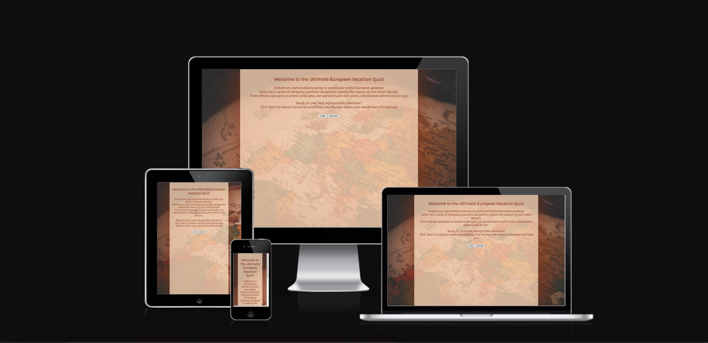
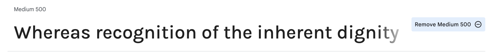
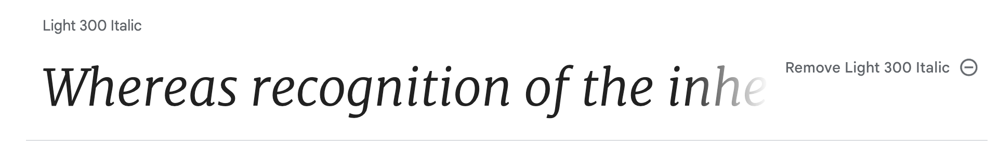
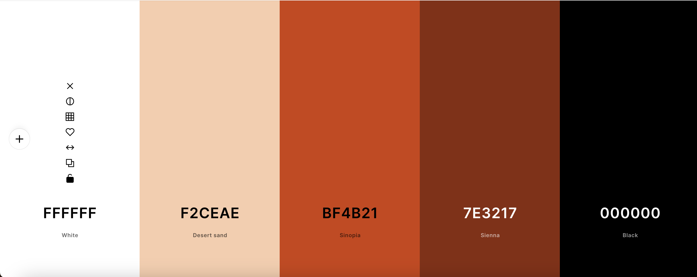

# [TRAVEL QUESTIONNAIRE](https://naomib2211.github.io/Travel-Questionnaire)

Embark on a journey of discovery with our Travel Questionnaire, designed for anyone dreaming of exploring the enchanting corners of Europe. Whether you're a seasoned traveler or setting out on your first adventure abroad, our interactive questionnaire tailors suggestions to your unique travel preferences. By shuffling questions each time, you can enjoy an ever-evolving experience, unlocking a myriad of destination possibilities. Travel Questionnaire is not just an app; it's your virtual travel companion, ensuring that your next European escapade aligns perfectly with your individual desires. 

##  Design Processes

- The design vision for this project were simplicity and a retro feel. A background image of a globe where Europe is centered was chosen. Colors were extracted from this image to create a simple yet cohesive feel to the questionnaire. Choice of fonts were based on the association of older style design choices for websites. 

### Font Design

- 'Karla' and 'Merriweather' for fonts of this app. Based on the creators associations to older style questionnaires, these two fonts were chosen as they complimented each other. 

+  [Karla](https://fonts.google.com/specimen/Karla#styles) was used for the emphasized, "important" sections, such as H1, start/restart- buttons and questions

 

+ [Merryweather](https://fonts.google.com/specimen/Merriweather#styles) was used for the rest, less emphasized sections, such as the paragraphs and the texts in the option-buttons.

### Colour Scheme

- As previously explained, these colors were chosen based on the background image of the website. Specifically these colors to create harmony but also enough contrast for accessability.  

- I used [coolors.co](https://coolors.co/ffffff-f2ceae-bf4b21-7e3217-000000) to generate my color palette.

- Here is the image the colors and the over style for this website was based on

## The project features

### Introduction

+ Below image shows the introductory start page. 
    * Descriptive title
    * Less descriptive body of text, serving the purpose of intruiging the visitor into the questionnaire, rather than describing what it is. Last pragraph describes how to start the questionnaire.
    * Has two button features:
        * 'START' button which leads the visitor to the start of the questionnaire
        * 'RESTART' button which leads the visitor ta refreshed page, at this stage.

### The Quiz

+ Below image shows the structure of the questionnaire
    * First section presents the question for the visitor to answer, it also presents which number of question the visitor is currently on. 
    * Second section shows the descriptive options, where the visitor chooses which option suits them the best based on the question presented above the options. When the visitor chooses an option it will be directed to the next question. This will go on until the last (10th) question, at which it will calculate the points the visitor has gathered answering all the questions. 
        * The option section is significant as this is the main feature that will create returning visitor,  it reshuffes the order of options everytime so that if the visitor wants to redo the questionnaire it won't be as predictive right away. 
    * Last section shows the 'Restart' button that will, at any point in time the visitor wants to restart the questionnaire it will lead the visitor to the introductional start page.

### The Result

+ Below image presents the result section of the questionnaire. This section rewards the visitor for going through the test with "travel-personality" description, based on chosen options to the visitor. Here one gets to see the suggestion to different destinations in Europe based on ones needs and wants.
    * The first section presents title of the visitor's "travel-personality" based on the previously answered questionnaire. In the image below the personality "Tourist" is shown. This feature was created to emphasize the feel of retro questionnaires from earlier, but also to regular personality-quizes that many are familiar with even today.
    * The second section serves to give a deeper explanation to the resulted "personality" that was given to the visitor. This section also serves a similar purpose to the title - to describe the personality trait that the visitor has based on the questions answered.
        * As people we are always curious of the world, but we are also curious of ourselves. Here the visitor will enjoy learning more about themselves whilst also learning where they could potentially travel to to enjoy themselves.
        * The most important feature here, besides the descriptive text is the result destination that the visitor gets. Another feature here is added in order for the visitor to come back multiple times. Multpiple European cities were added for each "travel-personality", so that when the visitor comes back to redo the test, they are presented with other travel destinations despite maybe answering identically in the questionnaire. So, here is another shuffling-feature.
    * The last section has, just like the other parts, the 'RESTART' button. For the visitor to redo the questionnaire over and over again. It's also always there in case the visitor wants to redo the questionnaire at any point in their progress. 

### Future Features

- Add the [Dialog](https://blog.webdevsimplified.com/2023-04/html-dialog/) element, an interactive popup for creator's credit

- Suggest links to flights and living options based on visitors result 

- Make the results page more organic and "painting the picture", with images based on the given "travel-personality", connected to suggested links to flights and living option.

## Tools & Technologies Used

- [HTML](https://en.wikipedia.org/wiki/HTML) used for the main site content.
- [CSS](https://en.wikipedia.org/wiki/CSS) used for the main site design and layout.
- [CSS Flexbox](https://www.w3schools.com/css/css3_flexbox.asp) used for an enhanced responsive layout.
- [JavaScript](https://www.javascript.com) used for user interaction on the site.
- [Git](https://git-scm.com) used for version control. (`git add`, `git commit`, `git push`)
- [GitHub](https://github.com) used for secure online code storage.
- [GitHub Pages](https://pages.github.com) used for hosting the deployed front-end site.
- [Gitpod](https://gitpod.io) used as a cloud-based IDE for development.
- [Visual Studio Code](https://code.visualstudio.com/) used as a cloud-based IDE for development.

## Testing

For all testing, please refer to the [TESTING.md](TESTING.md) file.

## Deployment

The site was deployed to GitHub Pages. The steps to deploy are as follows:

- In the [GitHub repository](https://github.com/Naomib2211/Travel-Questionnaire), navigate to the Settings tab 
- From the source section drop-down menu, select the **Main** Branch, then click "Save".
- The page will be automatically refreshed with a detailed ribbon display to indicate the successful deployment.

The live link can be found [here](https://naomib2211.github.io/Travel-Questionnaire)

### Local Deployment

This project can be cloned or forked in order to make a local copy on your own system.

#### Cloning

You can clone the repository by following these steps:

1. Go to the [GitHub repository](https://github.com/Naomib2211/Travel-Questionnaire) 
2. Locate the Code button above the list of files and click it 
3. Select if you prefer to clone using HTTPS, SSH, or GitHub CLI and click the copy button to copy the URL to your clipboard
4. Open Git Bash or Terminal
5. Change the current working directory to the one where you want the cloned directory
6. In your IDE Terminal, type the following command to clone my repository:
	- `git clone https://github.com/Naomib2211/Travel-Questionnaire.git`
7. Press Enter to create your local clone.

Alternatively, if using Gitpod, you can click below to create your own workspace using this repository.

Please note that in order to directly open the project in Gitpod, you need to have the browser extension installed.
A tutorial on how to do that can be found [here](https://www.gitpod.io/docs/configure/user-settings/browser-extension).

#### Forking

By forking the GitHub Repository, we make a copy of the original repository on our GitHub account to view and/or make changes without affecting the original owner's repository.
You can fork this repository by using the following steps:

1. Log in to GitHub and locate the [GitHub Repository](https://github.com/Naomib2211/Travel-Questionnaire)
2. At the top of the Repository (not top of page) just above the "Settings" Button on the menu, locate the "Fork" Button.
3. Once clicked, you should now have a copy of the original repository in your own GitHub account!

## Credits

🛑🛑🛑🛑🛑 START OF NOTES (to be deleted) 🛑🛑🛑🛑🛑

In this section you need to reference where you got your content, media, and extra help from.
It is common practice to use code from other repositories and tutorials,
however, it is important to be very specific about these sources to avoid plagiarism.

🛑🛑🛑🛑🛑 END OF NOTES (to be deleted) 🛑🛑🛑🛑🛑

### Content

| Source | Location | Notes |
| --- | --- | --- |
| [Markdown Builder](https://tim.2bn.dev/markdown-builder) | README and TESTING | tool to help generate the Markdown files |
| [Chris Beams](https://chris.beams.io/posts/git-commit) | version control | "How to Write a Git Commit Message" |
| [W3Schools](https://www.w3schools.com/css/css3_variables.asp) | entire site | how to use CSS :root variables |
| [Flexbox Froggy](https://flexboxfroggy.com/) | entire site | modern responsive layouts |
| [StackOverflow](https://stackoverflow.com/a/2450976) | quiz page | Fisher-Yates/Knuth shuffle in JS |
| [YouTube](https://www.youtube.com/watch?v=riDzcEQbX6k&t=1045s) | entire site | gave understanding on how to structure a quiz based on JS |
| [Youtube](https://www.youtube.com/watch?v=0ik6X4DJKCc) | entire site | Understanding the DOM better|
| [StackOverflow](https://stackoverflow.com/questions/70953748/increase-score-in-quiz-using-javascript) | entire site | point system for JS |
| [SimpleStepsCode](https://simplestepscode.com/javascript-quiz-tutorial/) | entire site | understanding JS through quiz projects |
| [ChatGPT](https://chat.openai.com/) | entire site | received suggestions on questions and language refining|

### Media

- Only image used was the background image of the entire site, from 

🛑🛑🛑🛑🛑 START OF NOTES (to be deleted) 🛑🛑🛑🛑🛑

Use this space to provide attribution links to any images, videos, or audio files borrowed from online.
A few examples have been provided below to give you some ideas.

If you're the owner (or a close acquaintance) of all media files, then make sure to specify this.
Let the assessors know that you have explicit rights to use the media files within your project.

Ideally, you should provide an actual link to every media file used, not just a generic link to the main site!
The list below is by no means exhaustive. Within the Code Institute Slack community, you can find more "free media" links
by sending yourself the following command: `!freemedia`.

🛑🛑🛑🛑🛑 END OF NOTES (to be deleted) 🛑🛑🛑🛑🛑

| Source | Location | Type | Notes |
| --- | --- | --- | --- |
| [Unsplash](https://unsplash.com/photos/white-red-and-green-map-7dEyTJ7-8os) | entire site | image | Background image|
| [TinyPNG](https://tinypng.com) | entire site | image | tool for image compression |

### Acknowledgements

- I would like to thank my Code Institute mentor, [Tim Nelson](https://github.com/TravelTimN) for their support throughout the development of this project.
- I would like to thank the [Code Institute](https://codeinstitute.net) tutor team for their assistance with troubleshooting and debugging some project issues.
- I would like to thank the [Code Institute Slack community](https://code-institute-room.slack.com) for the moral support; it kept me going during periods of self doubt and imposter syndrome.
- I would like to thank my mother (Genet), for believing in me, and allowing me to make this transition into software development. 
- I would lastly like to thank the staff at Student Care at [Code Institute](https://codeinstitute.net) for guiding me through this difficult time. Through the practical and less practical challenges during this period.

